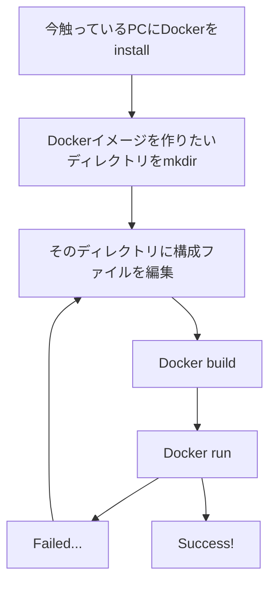

# はじまり
初めて、DockerでNode.js環境を作ったので備忘録も兼ねて書いておく。
行った環境は、Windows10です。

# 作業の流れ
全くの初めてだったので、やったことをおさらい。

# Dockerfileの中身（対話だけ）
今回ファイル実行ができる環境を作りたかったのですが、最初にNode.js対話環境だけを作るDockerfileを作ってBuildしてしまい詰まったので、これはJavascriptを打てるけどファイル実行はできないよと、メモっておく。
~~~Bash:Dockerfile
FROM node:14
EXPOSE 8888
~~~

# Dockerfileの中身（ファイル実行も）
こちらのDockerfileの内容であれば、
~~~Bash:Dockerfile
FROM ubuntu:latest
RUN apt-get update
RUN apt-get install nodejs -y
RUN apt-get install npm -y
RUN update-alternatives --install /usr/bin/node node /usr/bin/nodejs 10

ADD package.json .
ADD index.js .
CMD npm run start
~~~

# その他のファイル
以下、使ったファイルです。
~~~json:package.json
{
    "scripts": {
        "start": "node index.js"
    }
}
~~~

~~~javascript:index.js
console.log("test OK!");
~~~

# DockerのBuildとRun
Dockerfileの内容でBuildされる。Dockerfileの`CMD`はRunした時に実行される。
`--it`は、`-t`がないと仮想マシンを起動できず、`-i`がないと起動した仮想マシンにコマンドを実行できなくなる。
`--rm`は、コンテナを停止したときにコンテナが自動削除される。
~~~Bash:Command Prompt
# DockerイメージをBuildする
docker build -t my-nodejs-app .
# Dockerイメージを起動する
docker run -it --rm --name my-running-app my-nodejs-app
~~~

# Docker runの後
イメージに送ったファイルが実行されたことを確認。この画面を待っていた！！

ちなみに、Dockerfileに`CMD`を入れたら、対話せずにマシンが終了した。

# おしまい
コンフォート・ゾーン広がった。
細かいことはこれから。

# 主な参考サイト
https://qiita.com/shibukawa/items/f7076cf4b181ee141bcd
https://qiita.com/HorikawaTokiya/items/a2a174680d7dd759ccae
https://qiita.com/TsutomuNakamura/items/7a8362efefde6bc3c68b
https://qiita.com/k_uchida_____/items/8ca31226bd6d10850791
https://qiita.com/hoshino/items/9545d255cc0103b3d296
